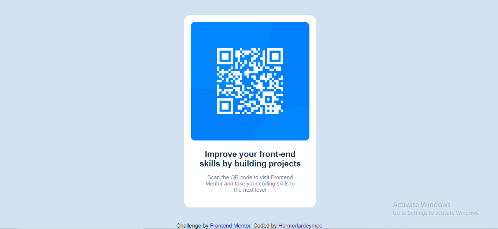

# Frontend Mentor - QR code component solution

This is my solution to the [QR code component challenge on Frontend Mentor](https://www.frontendmentor.io/challenges/qr-code-component-iux_sIO_H). Frontend Mentor challenges help you improve your coding skills by building realistic projects. 

## Table of contents

- [Overview](#overview)
  - [Screenshot](#screenshot)
  - [Links](#links)
- [My process](#my-process)
  - [Built with](#built-with)
  - [What I learned](#what-i-learned)
  - [Useful resources](#useful-resources)
- [Author](#author)
- [Acknowledgments](#acknowledgments)


## Overview

Your challenge is to build out this QR code component and get it looking as close to the design as possible.

You can use any tools you like to help you complete the challenge. So if you've got something you'd like to practice, feel free to give it a go.

Want some support on the challenge? [Join our Slack community](https://www.frontendmentor.io/slack) and ask questions in the **#help** channel.


### Screenshot




### Links

- Solution URL: (https://www.frontendmentor.io/solutions/frontend-mentor-challenge-qr-code-component-btgaKAvBQw.com)
- Live Site URL: (https://hormorlardeymee.github.io.QR-code-component/)

## My process

### Built with

- Semantic HTML5 markup
- CSS custom properties
- Flexbox
- CSS Grid

### What I learned
I had fun while working on this project. It was also very challenging as it made me realize how much i still have to learn. I look forward to my improvements.

### Code Snippet:
```html
<body>
    <div class="container">
        <div class="qr-code">
            
            <div class="text">
                <h2>    
                    Improve your front-end skills by building projects
                </h2 >  
                <p>
                    Scan the QR code to visit Frontend <br> Mentor and take your coding skills to <br> the next level
                </p>
        </div>
        </div>
    </div>
    <div class="attribution">
        Challenge by <a href="https://www.frontendmentor.io?ref=challenge" target="_blank">Frontend Mentor</a>. 
        Coded by <a href="#">Hormorlardeymee</a>.
      </div>
</body>
```
```css
.body{
    font-family: 'outfit', sans-serif;
    font-size: 15px;
    background-color: hsl(212, 45%, 89%);
    min-height: 100vh;
    display: flex;
    flex-direction: column;
    align-items: center;
}
```

### Useful resources

- [W3SCHOOLS](https://www.w3schools.com) - This is my  go-to site anyday and anytime. I practically learnt the foundation of HTML and CSS here.
- [MR CODER](https://youtu.be/5BBYPntB-GY) - After realizing how much I still had to learn, I had help from this youtube video. 


## Author

- Frontend Mentor - [@hormorlardeymee](https://www.frontendmentor.io/profile/hormorlardeymee)
- Twitter - [@hormorlardeymee](https://www.twitter.com/hormorlardeymee)
- Instagram - [hormorlardeymee] (https://www.instagram.com/hormorlardeymee)


## Acknowledgments

As this is my very first challenge as a frontend developer, i had a lot of helpfrom online resorces. A very big thank you to everyone out there that contributes in one way or another to teach the unknown and provide knowledge to the public.
